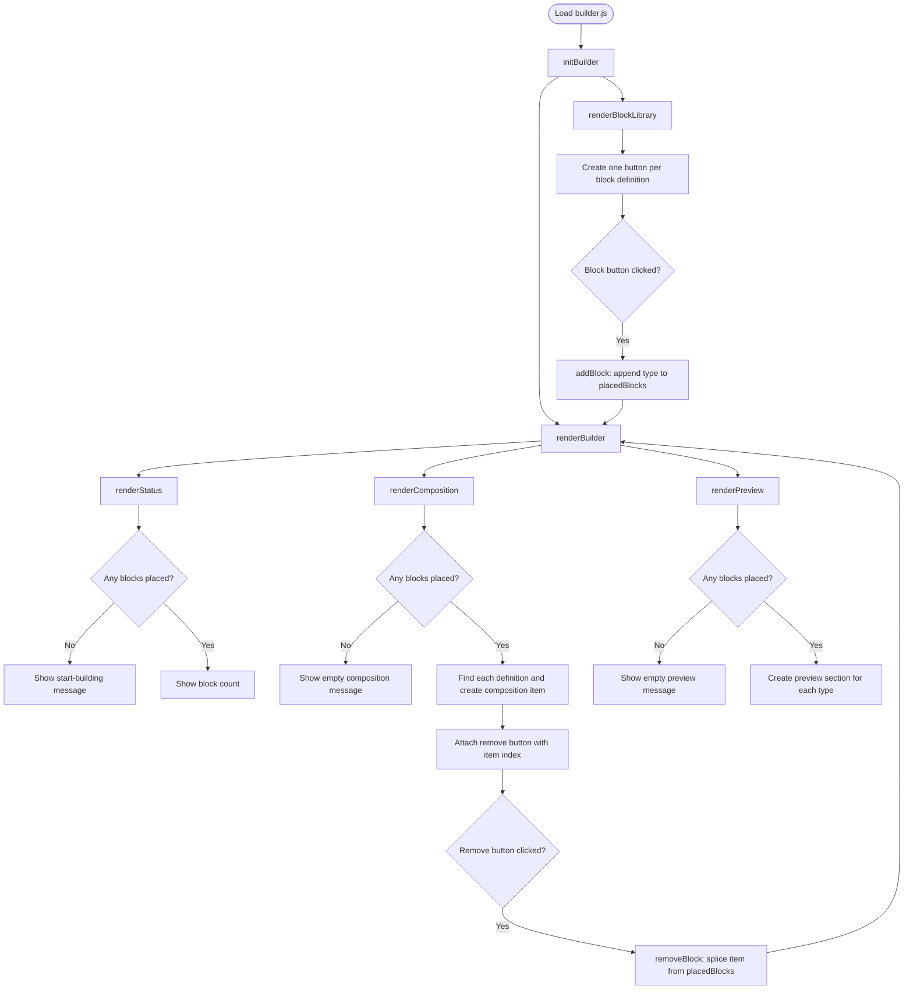

# Builder Flow

```mermaid
flowchart TD
    Start([Load builder.js]) --> Init[initBuilder]
    Init --> Library[renderBlockLibrary]
    Init --> Render[renderBuilder]
    Library --> Buttons[Create one button per block definition]
    Buttons --> Click{Block button clicked?}
    Click -->|Yes| Add[addBlock: append type to placedBlocks]
    Add --> Render

    Render --> Status[renderStatus]
    Render --> Composition[renderComposition]
    Render --> Preview[renderPreview]

    Status --> StatusCheck{Any blocks placed?}
    StatusCheck -->|No| EmptyStatus[Show start-building message]
    StatusCheck -->|Yes| CountStatus[Show block count]

    Composition --> CompositionCheck{Any blocks placed?}
    CompositionCheck -->|No| EmptyComposition[Show empty composition message]
    CompositionCheck -->|Yes| Items[Find each definition and create composition item]
    Items --> RemoveButton[Attach remove button with item index]
    RemoveButton --> Remove{Remove button clicked?}
    Remove -->|Yes| Splice[removeBlock: splice item from placedBlocks]
    Splice --> Render

    Preview --> PreviewCheck{Any blocks placed?}
    PreviewCheck -->|No| EmptyPreview[Show empty preview message]
    PreviewCheck -->|Yes| Sections[Create preview section for each type]
```
